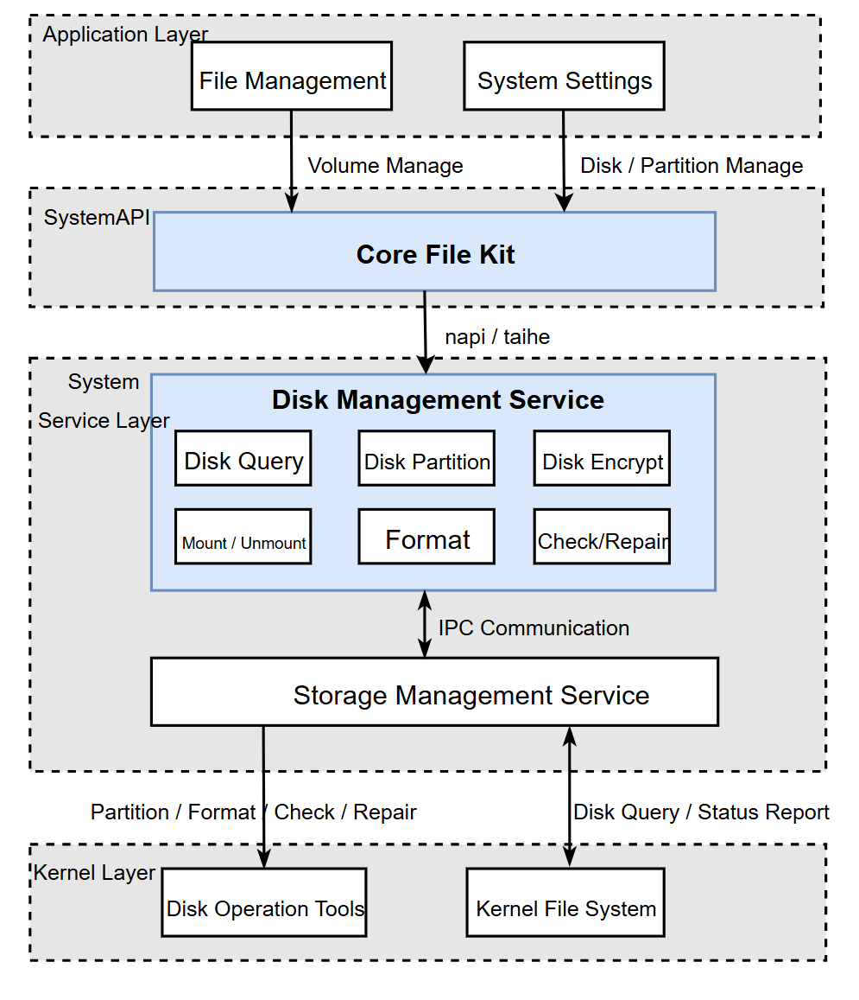

# Disk Management

## Introduction

Disk Management is the disk management component in the OpenHarmony file management subsystem. It uses open-source third-party disk operation tools integrated in OpenHarmony (such as `gptdisk`) and is responsible for disk and volume identification, mount/unmount, partitioning, checking, repair, formatting, and related event handling.

Disk Management provides the following common capabilities:

- Supports disk device information query.
- Supports functional operations on disk devices.

## System Architecture

**Figure 1** OpenHarmony Disk Management Architecture



### Architecture Description

As shown in the diagram, the system is composed of the application layer, SystemAPI, the system service layer, and the kernel layer:

- **Application Layer**
  - `File Management`: Initiates volume management requests for file and volume scenarios.
  - `System Settings`: Initiates disk/partition management requests for device maintenance scenarios.
- **SystemAPI**
  - `Core File Kit`: Provides a unified interface to upper layers and connects to system services through `napi/taihe`.
- **System Service Layer**
  - `Disk Management Service`: Core orchestration module responsible for state management, policy control, and external capability exposure.
  - `Disk Query`: Aggregates disk/partition information and status.
  - `Disk Partitioning`: Executes partition creation, adjustment, and deletion.
  - `Disk Encryption`: Handles disk encryption capabilities and workflows.
  - `Mount/Unmount`: Executes volume mount, unmount, and state transitions.
  - `Formatting`: Executes filesystem formatting.
  - `Check & Repair`: Executes filesystem check and repair.
  - [Storage Management Service](https://gitcode.com/openharmony/filemanagement_storage_service): Handles privileged operation execution, interacts with lower-level capabilities, and returns execution results.
- **Kernel Layer**
  - `Disk Operation Tools`: Provides low-level execution capabilities such as partitioning, formatting, checking, and repairing.
  - `Kernel File System`: Provides disk query and status reporting capabilities.

In terms of call flow, `File Management/System Settings` enter `Disk Management Service` through `Core File Kit`; then `Disk Management Service` collaborates with `Storage Management Service` through IPC; finally, the kernel layer completes actual disk operations and status reporting.

## Directory Structure

```text
.
├── interfaces/                  # Public interface layer (IDL, innerkits, JS, Taihe)
│   ├── innerkits/
│   └── kits/
├── services/disk_manager/       # SA service implementation (Provider, business management, daemon adapter)
├── sa_profile/                  # SystemAbility and process configuration
├── common/                      # Common error codes and base definitions
├── utils/                       # Logging and common utilities
└── test/                        # Unit tests and fuzz tests
```

## Key Capabilities

- Disk and partition event handling
- Volume information query
- Volume mount/unmount, formatting, checking, and repair

## Build and Integration

This repository is integrated as an OpenHarmony code segment. The target path is defined in `bundle.json`:

- `foundation/filemanagement/disk_manager`

## Usage Guide

### Developer Workflow

1. Add the corresponding `disk_manager` component target in your project.
2. Select the invocation method as needed (innerkits / JS / Taihe).
3. Use a volume ID or UUID to perform operations such as query, mount, unmount, format, and partition.

## Guide and API

[Guide and API](https://gitcode.com/openharmony/docs/blob/master/zh-cn/application-dev/reference/apis-core-file-kit/Readme-CN.md)

## API Reference

[System API Reference](https://gitcode.com/openharmony/docs/blob/ca6a74112dca41d78b4bb2ca2612aca7d2bce450/zh-cn/application-dev/reference/apis-core-file-kit/js-apis-file-volumemanager-sys.md)

This document describes the interfaces. System applications can identify, mount/unmount, partition, check, repair, and format supported disk devices. It helps developers quickly locate detailed interface behavior and invocation methods.

## Related Repositories

- [filemanagement_disk_manager](https://gitcode.com/openharmony-sig/filemanagement_disk_manager)
- [filemanagement_storage_service](https://gitcode.com/openharmony/filemanagement_storage_service)