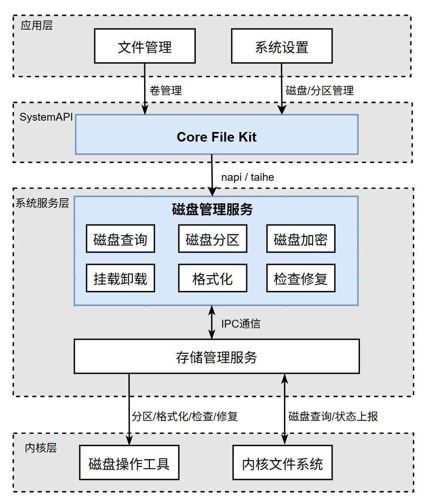

# 磁盘管理

## 简介

磁盘管理是 OpenHarmony 文件管理子系统中的磁盘管理部件，使用 OpenHarmony 中集成的开源三方磁盘操作工具（如 gptdisk 等），负责磁盘与卷的识别、挂载/卸载、分区、检查、修复、格式化及相关事件处理。

磁盘管理包含以下常用功能：

- 已支持磁盘设备的信息查询。
- 已支持磁盘设备的功能操作。

## 系统架构

**图1** OpenHarmony磁盘管理架构图



### 架构说明

按图中模块划分，系统由应用层、SystemAPI、系统服务层和内核层构成：

- **应用层**
  - `文件管理`：面向文件与卷场景发起卷管理请求。
  - `系统设置`：面向设备维护场景发起磁盘/分区管理请求。
- **SystemAPI**
  - `Core File Kit`：对上提供统一接口，对下通过 `napi/taihe` 接入系统服务能力。
- **系统服务层**
  - `磁盘管理服务`：核心编排模块，负责状态管理、策略控制和能力对外暴露。
  - `磁盘查询`：聚合磁盘/分区信息与状态。
  - `磁盘分区`：执行分区创建、调整与删除。
  - `磁盘加密`：处理磁盘加密能力及流程。
  - `挂载卸载`：执行卷挂载、卸载和状态切换。
  - `格式化`：执行文件系统格式化。
  - `检查修复`：执行文件系统检查与修复。
  -  [存储管理服务](https://gitcode.com/openharmony/filemanagement_storage_service)：承接特权操作执行，负责与底层能力交互并回传结果。
- **内核层**
  - `磁盘操作工具`：提供分区、格式化、检查、修复等底层执行能力。
  - `内核文件系统`：提供磁盘查询和状态上报能力。

调用关系上，`文件管理/系统设置` 通过 `Core File Kit` 进入 `磁盘管理服务`，再由其通过 IPC 协同 `存储管理服务`，最终调用内核层完成实际磁盘操作与状态回传。


## 目录结构

```text
.
├── interfaces/                  # 对外接口层（IDL、innerkits、JS、Taihe）
│   ├── innerkits/
│   └── kits/
├── services/disk_manager/       # SA 服务实现（Provider、业务管理、daemon 适配）
├── sa_profile/                  # SystemAbility 配置与进程配置
├── common/                      # 通用错误码与基础定义
├── utils/                       # 日志与通用工具
└── test/                        # 单测与模糊测试
```

## 主要能力

- 磁盘与分区事件处理
- 卷信息查询
- 卷挂载/卸载、格式化、检查和修复

## 构建与集成

本仓作为 OpenHarmony 代码段集成，目标路径见 `bundle.json`：

- `foundation/filemanagement/disk_manager`

## 使用指南

### 开发者使用流程

1. 在工程中引入 `disk_manager` 对应组件目标。
2. 按需选择调用方式（innerkits / JS / Taihe）。
3. 通过卷 ID 或 UUID 执行查询、挂载、卸载、格式化、分区等操作。

## 指南及 API

[指南及API](https://gitcode.com/openharmony/docs/blob/master/zh-cn/application-dev/reference/apis-core-file-kit/Readme-CN.md)

## API参考

[系统API参考](https://gitcode.com/openharmony/docs/blob/ca6a74112dca41d78b4bb2ca2612aca7d2bce450/zh-cn/application-dev/reference/apis-core-file-kit/js-apis-file-volumemanager-sys.md)

提供了接口的说明文档，系统应用可以对已支持磁盘设备，进行识别、挂载/卸载、分区、检查、修复、格式化等。可以帮助开发者快速查找到指定接口的详细描述和调用方法。

## 相关仓

- [filemanagement_disk_manager](https://gitcode.com/openharmony-sig/filemanagement_disk_manager)
- [filemanagement_storage_service](https://gitcode.com/openharmony/filemanagement_storage_service)